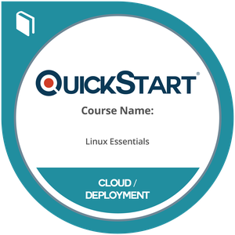
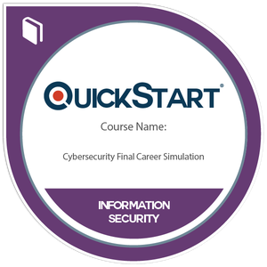

### Hi, I'm MCOMS 👋

Radio, drones and security tooling: I like knowing what's in the air and keeping the gear that watches it up to date.

- 📻 **Licensed Amateur Extra** radio operator
- 🚁 **FAA Part 107** certified remote pilot
- 🛡️ **Cybersecurity Boot Camp** graduate (2025)

---

### 🔧 Featured project: [PenWare](https://penware.app)

**Firmware watch for security research hardware.** PenWare tracks official firmware releases for 13 ESP32, Flipper Zero, SDR and multi-tool devices, and alerts me when something new ships.

- **Automatic release checks** every 6 hours with GitHub Actions, emailed as alerts
- **Official sources only:** GitHub releases, vendor update manifests and vendor portals
- **USB firmware backups** straight from the browser (Web Serial + esptool-js), with SHA-256 fingerprints
- **Install and recovery guides** for every device
- **No accounts, no tracking:** each person's settings stay in their own browser

Built with TanStack Start, React, Tailwind and Vite. Hosted on Vercel. → [penware.app](https://penware.app) · [source](https://github.com/mmcoms/PenWare)

---

### 🎓 Cybersecurity Training

Completed a 2025 Cybersecurity Boot Camp: five core courses and three hands-on career simulations.

  
  
  
  
  
  
  
  

Cyber Security Essentials · Cybersecurity Analyst Essentials · System and Network Security · Security Operations and Architecture · Linux Essentials · three hands-on Career Simulations

---

### 🧰 What I work with

**Hardware:** ESP32 (S3, C5, CYD boards) · Flipper Zero · HackRF + PortaPack · WiFi Pineapple · multi-radio pentest tools
**Radio:** amateur HF/VHF/UHF · SDR · 2.4 / 5 GHz Wi-Fi · BLE · Sub-GHz
**Software:** GitHub Actions · Vercel · DNS & email (SPF/DKIM/DMARC) · Web Serial · Linux

---

Everything I build or share is for authorized testing and education. Only test systems you own or have permission to test.
